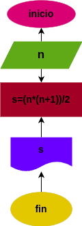

# Suma_n_Numeros
suma de los n primeros numeros naturales

# Analisis

## Input

### Variabes de entrada
n: numero al que se debe aplicar la formula 
### Processing
s: suma de los primeros n numeros

s = (n*(n+1))/2

### Output
s
# Diseño

# Construccion
